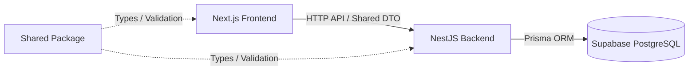

# Full-Stack Monorepo Architecture: Next.js + NestJS + Supabase

เอกสารนี้อธิบายโครงสร้างสถาปัตยกรรมและ Folder Structure สำหรับโปรเจกต์ Full-Stack "Gameverse" โดยใช้ระบบ **NPM Workspaces (Monorepo)** เพื่อแชร์โค้ดระหว่างหน้าบ้านและหลังบ้าน

## 1. ภาพรวมสถาปัตยกรรม (Architecture Overview)



- **Frontend (Next.js)**: รับผิดชอบส่วนติดต่อผู้ใช้งาน จัดการ UI/UX โดยใช้ Server Components และ Client Components แยกส่วนกัน
- **Backend (NestJS)**: เป็น API Gateway ประมวลผล Business Logic หลัก จัดการ Security, Validation และ Authorization 
- **Database (Supabase)**: ใช้ประโยชน์จาก PostgreSQL โดยเชื่อมต่อจาก NestJS เป็นหลักผ่าน Prisma
- **Shared Layer (@shared/dto)**: แพ็กเกจตรงกลางสำหรับแชร์ Types, Interfaces และ DTOs (Data Transfer Objects) เพื่อให้ Frontend และ Backend คุยกันด้วยโครงสร้างข้อมูลเดียวกันเสมอ

---

## 2. โครงสร้างโฟลเดอร์แบบ Monorepo (NPM Workspaces)

โปรเจกต์จะถูกรวมอยู่ใน Repository เดียวกัน และบริหารจัดการผ่าน NPM Workspaces ด้านนอกสุด

```text
my-jamine-project/
├── package.json                   # รัน npm install ที่นี่ที่เดียว (มี workspaces: ["packages/*"])
├── packages/
│   ├── frontend/                  # --- 1. FRONTEND APPLICATION (Next.js) ---
│   ├── backend/                   # --- 2. BACKEND APPLICATION (NestJS) ---
│   └── shared/                    # --- 3. SHARED LAYER (DTOs & Contracts) ---
└── ARCHITECTURE.md
```

---

## 3. Frontend Architecture (Next.js)

ยึดหลักการ Feature-Based Organization และลดการใช้ Client Components โดยไม่จำเป็น

**โครงสร้างย่อย (packages/frontend/src/):**
- `app/`: Next.js App Router แยก Route Groups เช่น `(auth)`, `(admin)`
- `components/`: UI Components ที่ใช้ซ้ำ (เช่น `common/Navbar`, `ui/Button`)
- `features/`: แยก Logic และ UI ตามโดเมนธุรกิจ (เช่น `articles`, `games`, `auth`)
- `lib/`: API Client (Axios/Fetch) และ Utility Functions
- `types/`: Types เฉพาะเจาะจงของหน้าบ้าน (ถ้าเป็น Data จาก API ให้ดึงจาก `@shared/dto`)

**Best Practices:**
- ใช้ Server Components เป็น Default (ห้ามใส่ `"use client"` พร่ำเพรื่อ)
- การดึงข้อมูลควรทำที่ Server Component หรือใช้ TanStack Query กรณีเป็นฝั่ง Client 
- ไม่เขียน Logic การต่อ Database ใน Frontend เด็ดขาด

---

## 4. Backend Architecture (NestJS)

ยึดหลัก Layered Architecture และ Enterprise Production Blueprint

**โครงสร้างย่อย (packages/backend/src/):**
- `main.ts`: ท่อลำเลียงหลัก (Security Helmet, CORS, Global Validation Pipe)
- `modules/`: แยกการทำงานเป็น Feature Modules (เช่น `auth.module.ts`, `articles.module.ts`)
  - `controllers/`: รับ HTTP Request
  - `services/`: จัดการ Business Logic
- `common/`: Guards, Interceptors, Decorators ส่วนกลาง
- `prisma/`: โฟลเดอร์จัดการ Database Schema (`schema.prisma`) และ Migrations

**Best Practices:**
- ไม่ Hardcode Environment Variables (ใช้ Joi/Zod ตรวจสอบ `DATABASE_URL` เสมอ)
- การเขียน Unit Test (`.spec.ts`) ให้ Mock Prisma Service เสมอ ห้ามต่อ Database จริง
- ใช้ ValidationPipe ร่วมกับ DTO เพื่อกรองข้อมูลขยะ

---

## 5. Shared Package (@shared/dto)

เป็นหัวใจสำคัญของ Monorepo ช่วยลดการเขียน Type ซ้ำซ้อน

**ปัญหาที่ต้องระวัง (Decorator Crash):**
- **ห้าม**ใส่ Decorator ของ `class-validator` (เช่น `@IsString()`) ในโฟลเดอร์ Shared เด็ดขาด เพราะ Next.js จะพังตอน Build
- **ทางแก้ (Plain Class):** เขียนแค่ Class เปล่าๆ ใน Shared แล้วให้ NestJS ดึงไป `extend` เพื่อใส่ Decorator ใน Backend เท่านั้น
- **ทางเลือกอนาคต (Zod):** ใช้ Zod เขียน Schema ใน Shared แล้วทำ Type Inference เพื่อนำไป Validate ทั้งฝั่ง React-Hook-Form (Frontend) และ NestJS-Zod (Backend)

**โครงสร้างย่อย (packages/shared/):**
- `src/index.ts`: เป็น Barrel file สำหรับ Export DTO ทั้งหมด (`export * from './articles/article.dto'`)
- `package.json`: ตั้งชื่อแพ็กเกจเป็น `"name": "@shared/dto"`

---

## 6. แผนการดำเนินงาน (Action Plan)

นี่คือสิ่งที่เรากำลังจะทำต่อไปเพื่อปรับโปรเจกต์เข้าสู่สถาปัตยกรรมนี้:

1. **Initialize NPM Workspaces**: 
   - ย้ายโฟลเดอร์ `frontend` ปัจจุบันเข้าโฟลเดอร์ `packages/frontend`
   - สร้าง `package.json` ด้านนอกสุดเพื่อผูก Workspaces
2. **Setup Shared Layer**:
   - สร้าง `packages/shared` พร้อม `tsconfig.json`
   - สร้าง DTO ตัวแรก เช่น `ArticleDto`
3. **Scaffold NestJS Backend**:
   - รัน CLI สร้าง NestJS ใน `packages/backend`
   - ติดตั้งและตั้งค่า Prisma เพื่อเชื่อมต่อ Supabase
4. **Connect & Refactor**:
   - ปรับหน้าบ้านจาก Mock Data (`mockArticles.ts`) ให้มาดึงข้อมูลจริงจาก NestJS API โดยใช้ Type จาก `@shared/dto`
